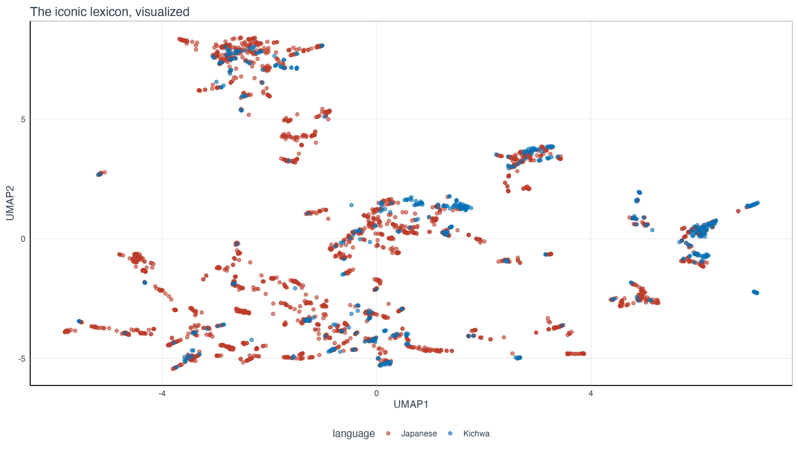

What an incredibly research-active summer it has been. 
And thus far also a pretty intense fall.

Here I am giving a brief summary of my research trips to Taiwan, Hong Kong, and the three conferences I attended in Slovakia, France, and Spain.
I'll give a short update of my project as well and what has kept me busy the past few months.

# Invited talk in Taiwan (June 2025)

I was fortunate to return to National Taiwan University, my Alma Mater, to meet up with my former supervisor Chiarung Lu, some old friends and classmates, and the newer cohorts of graduate students.
That always starts with good food (and very often also ends with good food).

Dinner with the NTU GIL professors.

Lunch with Iju Hsu.

Friends from the Summer+ programme I attended at NTU in 2014!

A drink with Powei Li.

Visiting a scenic village with A-Sheng, my cohort's most dependable friend.

A goodbye karaoke with CJ Young.

Streetfood in Taipei.

The main reason I wanted to go back to Taiwan was to attend the 30th anniversary of the [Graduate Institute of Linguistics at National Taiwan University](https://linguistics.ntu.edu.tw/), where I did my PhD.
It was really great to see again all my fellow students, but also GIL'ers past and present.
Can you spot me in the pictures below?

I was also able to finally make a bucket list item come true, namely visiting the [Ju Ming 朱銘](https://en.wikipedia.org/wiki/Ju_Ming) (1938-2023) museum.
Ju Ming was a Taiwanese artist who, to me at least, is mostly known for his Tai Chi series of stone sculptures.
We had one in front the Lèxuéguǎn that used to house the [GIL.](https://linguistics.ntu.edu.tw/)
Fun fact, I was attacked by a protected bird species, the [Taiwan blue magpie](https://en.wikipedia.org/wiki/Taiwan_blue_magpie), but don't worry: 
I'm a survivor.

Finally, I also delivered a talk here, on the "Empirical accountability meets theorizing about language variation: The Principle of Optionality." 
This is part of a research project that I was actively working on with Benedikt Szmrecsanyi at KU Leuven.
Basically, we keep finding that grammatical optionality (of the type *I gave the glass to you* vs. *I gave you the glass*) do not lead to more filled pauses or unfilled pauses, that is, things like *uh* and *um* or speech planning time. 
This is somewhat problematic for stubborn interpretations in theoretical linguistics, that have an idea of isomorphism baked into their foundations as a some sort of holy principle.
Conversely, in actual language production, you know the thing we can observe, such grammatical optionality is not a problem.
So the conclusion this points to is that there is at least a counter principle, namely a Principle of Optionality, that provides a number of benefits for developing and keeping around more than one way to express the same meaning. 

# Invited talk in Hong Kong (June 2025)

Next stop, Hong Kong.

Here too, it was great to meet up with all the friends and ex-colleagues that made the two years I spent there worth [the initial three-week covid ~lock-up~ quarantine](https://www.thomasvanhoey.com/posts/2021-05-13-bird-set-free/). 
I look back at my time at the University of Hong Kong with bittersweet feelings, for a number of reasons.
But focusing on the sweet aspect, forging a new network of friends and like-minded linguists (or academics in general) reverberates until now even. 

Lunch with the Language Development Lab.

After the talk I gave at HKU, with my friend Stephen Matthews.

My friends Aaron Chik and (by now) Dr. Rayne Yu!

Dr. Sevilla

My barber Anson

And of course Dr. Do! (Okay okay, Youngah and I are on a first-name basis 🤣)

I went back to Lamma Island, where I used to live.
And somehow, I ended up at a friday quiz night!

On the last day I enjoyed some beers with (soon to be) Dr. Hwang and (currently) Dr. Yu, whom I also gave some Belgian chocolate:

Just to say that the network I built there was still alive and kicking. 
I have missed the people I met in Taiwan and Hong Kong a lot in the past few years, but I am also sure that our paths will keep crossing.

# Conference in Košice, Slovakia (June 2025)

As you might surmise, June was a pretty busy month.
It ended with [the Word-Formation Theories VII & Typology and Universals in Word-Formation VI](https://www.upjs.sk/en/podujatia/conference-word-formation-theories-vii-typology-and-universals-in-word-formation-vi/), where we had a lovely workshop on sound symbolism.
The workshop was largely organized by Lívia Körtyelvessy (and Pius Akumbu!), who also recently was part of the editors for the [*Onomatopoeia in the world's languages*](https://www.amazon.com/Onomatopoeia-Worlds-Languages-Comparative-Linguistics/dp/3111051552).
I was fortunate enough to be invited to write the chapter on Mandarin in this handbook.
But even more fortunate to keep on working with Lívia on a second project (that I did together with my student Ruiming Ma) and currently I'm organising a workshop on typology of sound symbolism and ideophones for next year's SLE. 
You're coming too, right?

Here are some pics from the workshop.

# Sunsets and spreadsheets

During the summer, I worked quite hard on my FWO project and managed to identify a gap in the literature that has been occupying me for quite a while.
I hadn't really foreseen it in my grant application but I do have the "academic gut feeling" that this is something that's needed in the field, so I'm working on that.
But I'm only teasing it here because it's still very much work in progress.

So instead, I'll give you a few photos of fun events during the summer, without context.

# Conference in Bordeaux, France (August 2025)

The next big event in our tale is the SLE 2025 conference in Bordeaux.
Here I attended two very interesting workshops.

(1) A workshop on the Principles of Isomorophism and Optionality, organized by Cameron Morin and Benoît Leclerq. 
We basically got to defend and later befriend the other camp (the organizers).
It was really great to see some colleagues present in this workshop, such as (soon to be Dr.) Chiara Paolini, and my PhD student Ruiming Ma.
It's really great to see how much they have grown in the past few years.

(2) But of course, my "main dish" was the workshop on iconicity, organized by Maria Flaksman and Chris Smith.
Here I got to present for the first time my [current FWO project](https://www.thomasvanhoey.com/projects/borrowing_iconic_words/) in which I look at universal and borrowable patterns of iconic words in a sample of the world's languages.
All exciting stuff, keep an eye out for more.
It's also where the image in the header of this update comes from.
Basically, I was able to plot the iconic lexicons of two languages (Japanese and Kichwa / Quechua) in terms of semantic features. 

But again, your own work is only half the story at a conference.
Getting to (re)connect and watch colleagues, friends, linguists in action, that's what really makes it worth going there.

Like, here is Dr. Ellison Luk in action (together with Dr. Dana Louagie):

Or there's a whole Taiwan crew (with Ian Joo and Shengfu Wang a.o.)

And some selfies with colleagues that I keep bumping into, such as Veronika Zikmundova and Pius Akumbu:

And sometimes it's also just to share bad presentations or, when that doesn't work, go to the beach:

But, should there be a junior researcher reading this, it often pays off to go to events like the conference dinner (this one was very bad) or the other social event stuff (receptions etc.). 
You might meet people that went to the same place on the same day "but how come we didn't run into each other" like what happend to Dr. Niklas Erben Johansen and Prof. Aleksandra Bageshova.

Or meet HKU people like Dr. Hing Yuet Fung.

Or indavertedly end up being dressed as the French flag (with Anthe Sevenants and Alexander Van Herpe):

# Conference: Santiago de Compostela (September 2025)

The final conference of this year's conference season was the isLE conference, which is all about English linguistics.
You know, I'm somewhat of an Anglicist myself, if not in training, then certainly in occupation.
Here I was involved in two presentations again.

(1) Together with Benedikt Szmrecsanyi (and Ruiming Ma, and Matt H. Gardner), we spread the word on the non-attraction of (un)filled pauses by grammatical optionality here as well. 
I can say that while the reception at SLE was courteous, it was also cautious from some people in the workshop.
Very different story here in Compostela: most people at isLE actively love the work we've been doing, one of them being one of the keynotes, Alexandra D'Arcy.
I found it very encouraging and am sure we can keep on investigating these things in the future.

I didn't want to deny you guys this rather nice picture of Benedikt and myself:

(2) Part of the fun but unforeseen past reverberations of conferences has been my work with modality specialist Dr. Alessandro Basile.
Together, we've been working on quantifying some of the evolutions of modality markers in Singaporean English. 
Here, Alessandro did the hard work of presenting our work (the first picture is staged).

But the same as before, the dinner is often where bonds are forged. I was very lucky to be at a great table with some lovely linguists from Bamberg, Osnabrück, but also two KU Leuven colleagues, Juliette Kayenbergh and Hilke Ceuppens. 
I found both of their presentations really interesting and so I'm looking forward to see how their research develops in the next few years.

Finally, Santiago de Compostela was perhaps the most scenic city I got to visit in this conference round.
We even got to go on the rooftop of the cathedral!!

The hospedería I stayed at is right behind me:

Finally, shoutout to Mathilde and Alessandro for taking me to eat Galician tapas (including the pulpo), which was delicioso.

# Outro, languishing leaves

What people don't always understand about this conference season, is that it's fun yes, but it's also *very* tiring. 
You (well, I) are typically always active, you're sleeping less, you're engaged more (even though I did play my zombie game on my phone during boring presentations -- sometimes you walk in and after a minute you realize you made a mistake). 
And to make it really work, you need to bring your A game, I wouldn't want to give my colleagues anything less nor expect anything less from them in return.

In between those intense periods, there's a lot of boring work, full of spreadsheets and analysis, most of which will never see the light of day, all in the pursuit of knowledge.
[I keep finding it hard to resist the pressure of the LLM](https://www.thomasvanhoey.com/posts/2025-05-26-can-t-spell-koolaid-without-ai/) apologists whose research now solely revolves around probing the nature of "what the LLM thinks" (it doesn't and it's numbers with a lettered face), but I must say that occasional use is okay, but always intentional and after first exhausting other options.

Finally, to link the summer with this autumnal season in which I'm writing these words: after the summer I started preparing the classes I'm teaching this semester (first and second year intros to linguistics, colloquially known as ATW1 and ATW2 -- yes I have become *the* Dirk Geeraerts this year, at least I try channeling him from time to time too, even though the course content and concomitant style has shifted towards typology JC Verstraete style and semantics/pragmatics Tim VD Cruys style).
I've also spent some time (unfortunately unfruitfully) preparing for a job application and a major next grant.
Let's keep our fingers crossed for that one.
And now it's back to the trenches of manuscript writing.
I invoked that ACADEMIA IS WAR framing as a segue to this goodbye picture: Guérnica by Pablo Picasso.

Until we read again!

