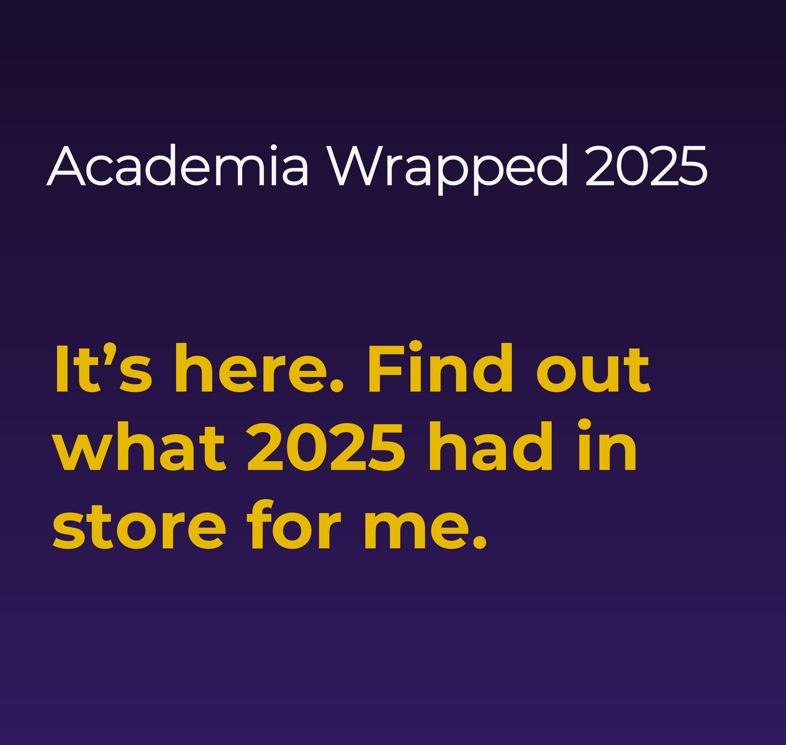

Every November (although I can't shake the feeling it used to be in December), Spotify users around the world get a major throwback thursday moment: they get their Spotify Wrapped.
In that grand tradition (and who knows, maybe we will all leave Spotify next year), here's my Academia Wrapped 2025.
As always, I'm half-joking. 
With that disclaimer, let's have a look:

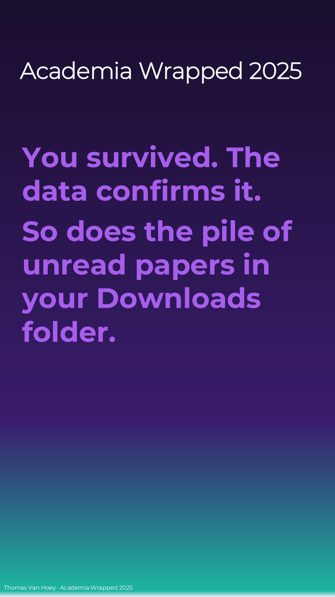

Geez, I didn't know 154 unread papers was such a big deal. I just like collecting, okay?

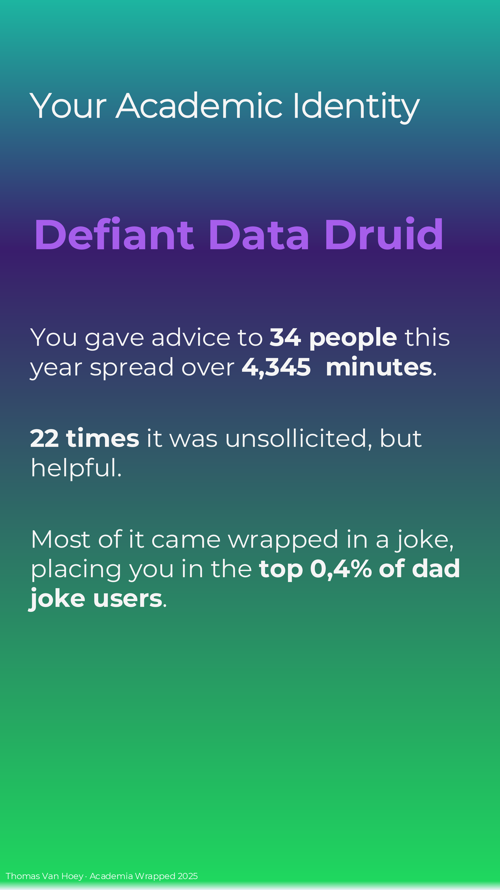

This checks out.

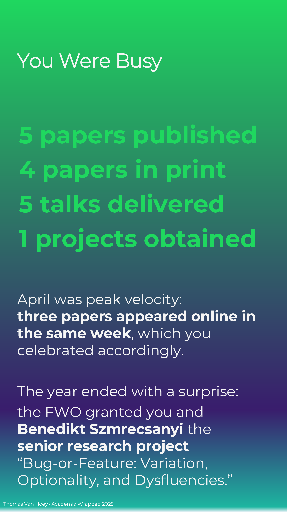

Very grateful for obtaining this project. It continues our work, together with Matt Hunt Gardner (Queen Mary University of London). Linguistic variation is a really interesting area!

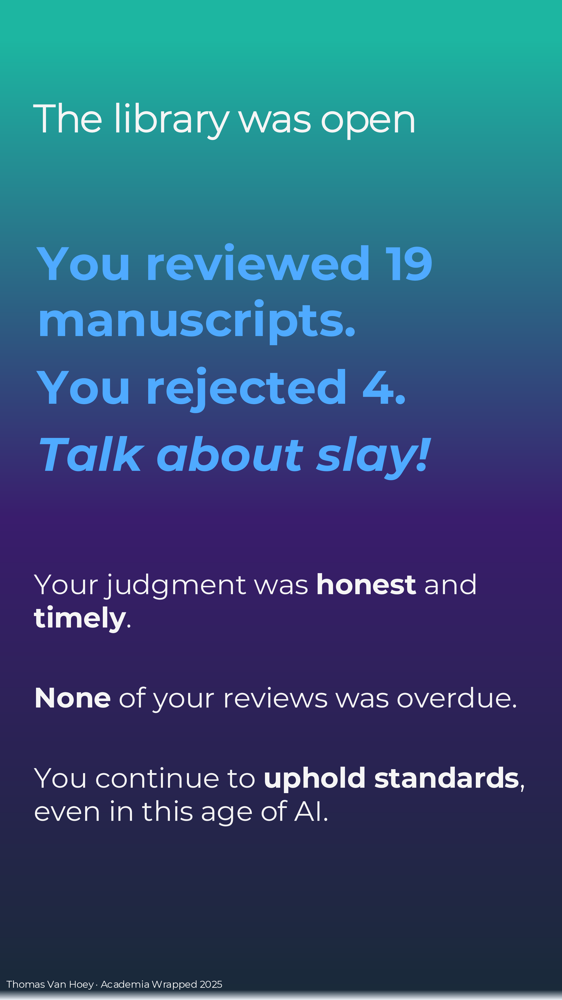

Honestly, I love reviewing, because it gives me a sneek peak at the cool and edgy stuff that will be coming out.

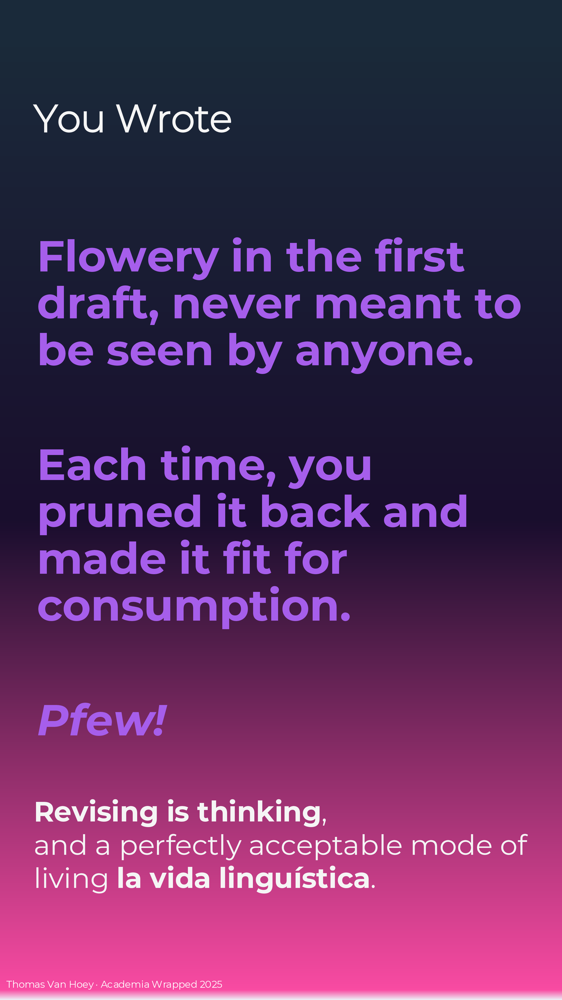

Fair enough.

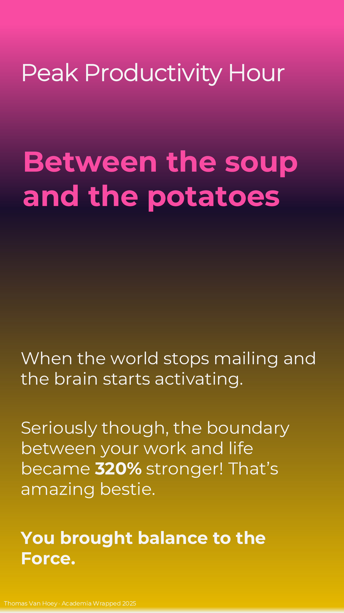

My best work ideas find me when I'm not at work. 

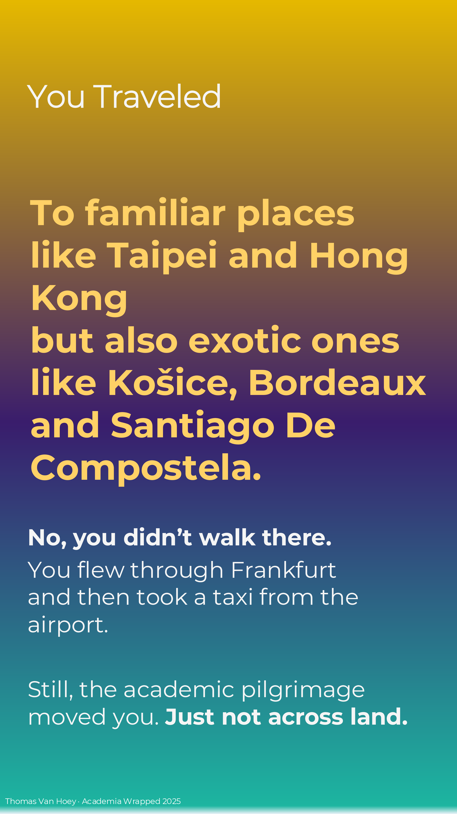

Very grateful for all the interesting people I got to meet along the way! Let's see each other again soon.

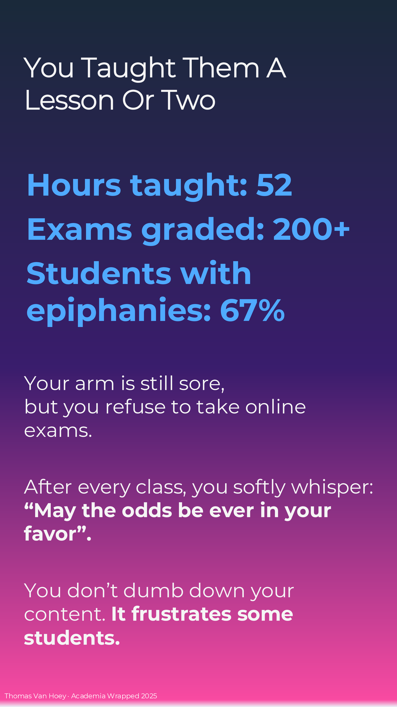

Taking over the intro classes for general linguistics (both 1 and 2) has turned into a source of inspiration to keep motivating the next generation.

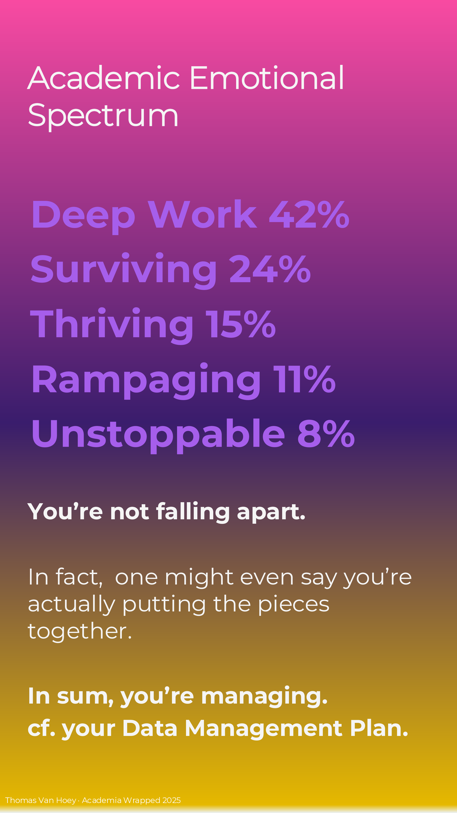

Putting the pieces together... I guess I do like a puzzle.

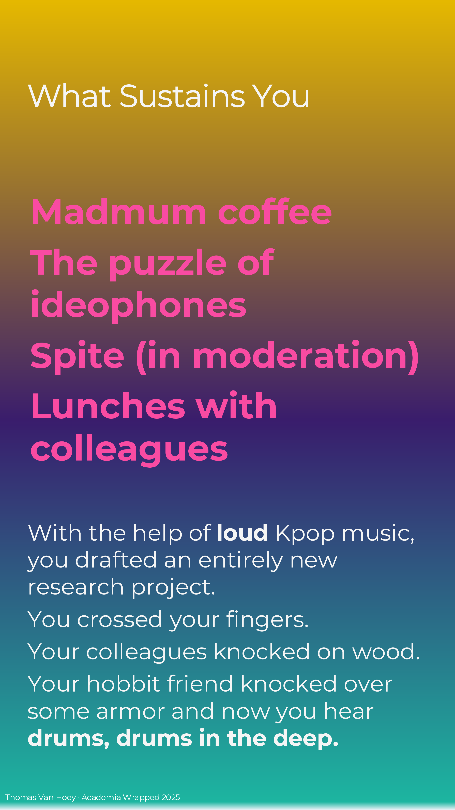

What did I say?! I do like a puzzle.
And lunch with the colleagues.
It's gonna be a hard few weeks during the Christmas break.

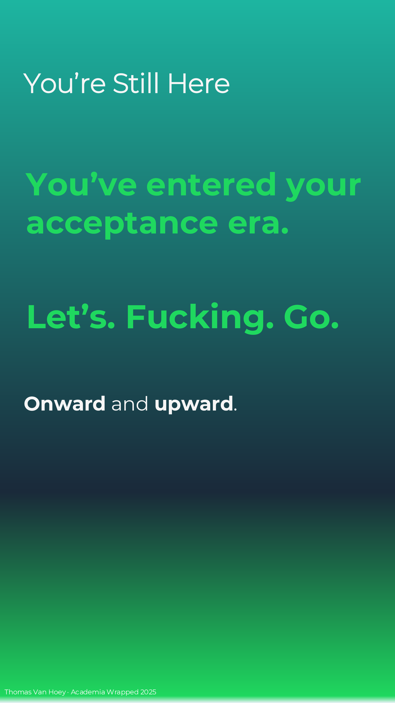

Let's. Fucking. Go.

----

Hope you enjoyed reading.

If you too make your own Academia Wrapped 2025 (or if you're reading this later), I just made it in MS Powerpoint.
Contact me if you want the slides, but I want to see your wrapped in return!
But please, do not contact me with some AI-generated emoji-ridden Linked-in "summary". 
We're all adults: we *can* spend the effort to make a good product or leave in the realm of possibilities.
[In the words of the Korean philosophers ENHYPHEN](https://youtu.be/XSzIhZxhTPk?si=xM43_px0ME4Z64sr):

> Go Big Or Go Home.

Merry Christmas. Merry Yule. Merry Alban Arthan. Merry had a little lamb.

