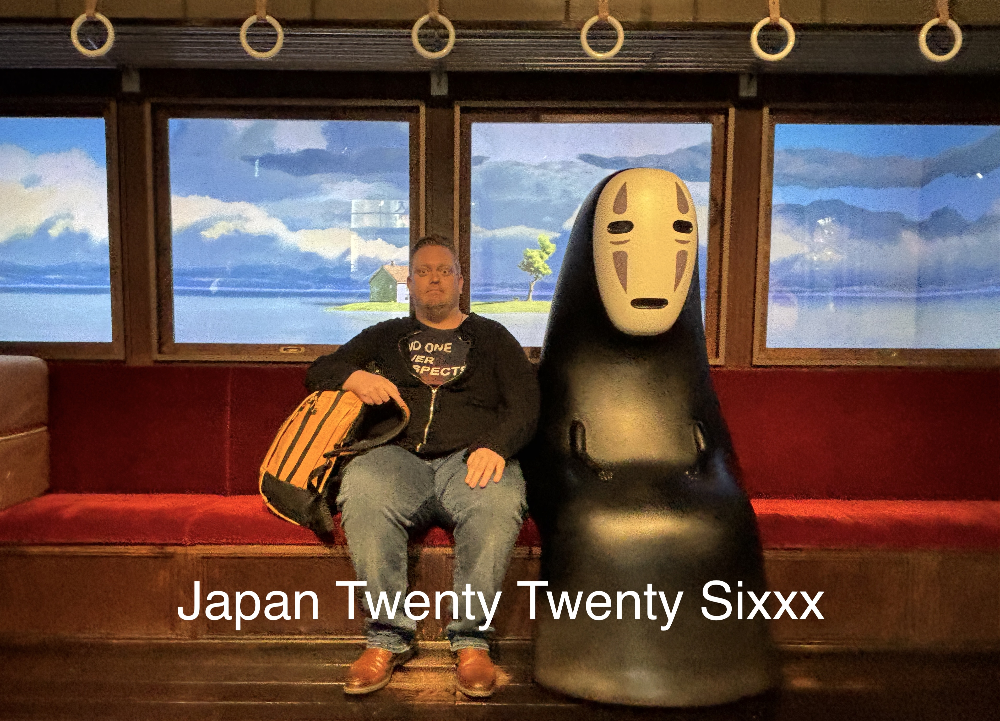
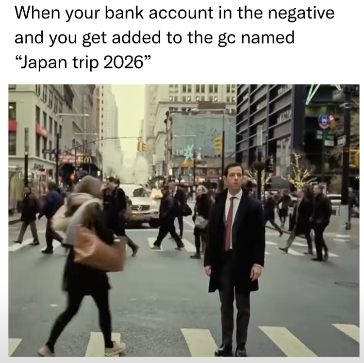

It's a meme!
With the recent exchange rate of the Japanese yen, many people have been talking about adding you to the group chat named "Japan trip 2026".

Jokes aside, I have been privileged to be able to attend not one but two academic events in Japan recently.
In Nagoya, there was the Joint conference of the 4th Iconicity Seminar (IcoSem) and the 15th International Symposium on Iconicity in Language and Literature (ILL), [**IcoLL**](https://ianjoo.github.io/icosem/4.html) for short (which is what I'll be using).
Later, in Otaru, there was the 1st Workshop of the Hokkaido Language Science Society, [**Hokugen**](https://ianjoo.github.io/hokugen/1) for short.

Of course, long-term readers of this blog, such as the brothers [Van Dyck](https://en.wikipedia.org/wiki/Van_Eyck), will vividly recall that I have been to Japan before. 
The first time was in 2016 ([chronicled here](https://www.thomasvanhoey.com/posts/2017-04-01-japanese-linguistic-ninjal/)), the second time in 2017 ([read about it here](https://www.thomasvanhoey.com/posts/2018-03-01-wrapping-up-2017-big-in-japan/)), and the third time in 2019 ([クリックヒール](https://www.thomasvanhoey.com/posts/2020-07-14-hashtag-dissertating/)). 
After that, Japan basically closed its borders for all I was concerned -- okay okay, not in a [*sakoku* 鎖国](https://en.wikipedia.org/wiki/Sakoku) kinda way but due to covid and just lack of opportunities on my end to go there.

Anyways, I had been looking forward very much to this particular trip because Japan is a truly wonderful place to visit.
This would be the first time I went there at the end of winter.
In Nagoya, you really didn't feel that, especially the later days.
But in Sapporo and Otaru, both in Hokkaido, man, it was cold, icy, and slippery (only fell twice).

Before we get in the meet of this post (pictures), I want to acknowledge the Research Foundations Flanders (FWO) for the travel grant and benchfee attached to my project.

# IcoLL (Nagoya)

It's been the third time that I participate in the Iconicity in Language and Literature conferences.
Each time has provided great opportunities to meet with leading scholars in my field, and more importantly, to gauge what the state of the field is.
What edgy and new research topics are being pursued, and what can I learn from them?
I especially appreciate that this conference's goal is to explicitly also include a literature dimension. 
Too often, people stay within the boundaries of their own discipline.
And while I don't think we are all going up the same mountain (in fact, some are going down into the valley if you'd ask me), the means of mountaineering and the travel reports give rise to opportunities for reassessing your own methods.
This is a very convoluted metaphor to say that I went to some literature talks and enjoyed them.
I even dared to ask some questions:

And I was happy to present a paper I'm doing together with Xiaoyu YU, Shuhao ZHANG, Youngah DO (all HKU) and Dan DEWEY (Brigham Young University) entitled "Behavior mirrored in the brain: An fNIRS study of Chinese ideophone modal exclusivity". 
Here is me presenting that bit.

In the paper, currently under review so if any of the reviewers is reading this, hurry up, we basically compare new behaviorally constructed multisensory profiles for collocate-ideophone constructions of the ABB type in Chinese, with neurolinguistic methods. 
Drop me a message if you want more info or the preprint.

This conference also proved to be the ideal occasion to reunite with my PhD supervisor, Chiarung LU.
We had a sort of *yuánfèn* 緣分 on the first day. 
As I descended into the depths of the metro system, I suddenly heard a voice behind me "Thomas, 阿智". 
And lu and behold, there was Chiarung with her colleague.
We made our way to the venue together and got ready for a nice conference.

Later I saw Chiarung present, which was very *huíwèi* 回味 for me (there's probably a German word that captures that feeling).

The conference also provided ample opportunity to (re)connect with other iconicity scholars.
Most of the good stuff happens during dinners and post-dinner activities. 
Since this is Japan, that meant karaoke.
Unfortunately, I will not be posting videos or pictures of said karaoke.
But feel free to take me singing if you want to experience the tragedy of *Total eclipse of the heart* sung live by me, given that "every now and then I fall apart" as well.

I was very grateful then to meet the rest of the Taiwanese delegation, pictured here at the soon-to-be-eaten conference dinner.

Turns out that Japanese conference dinners are often walking dinners.
While that was, uhm, unfortunate last summer at SLE, this time it didn't bother me at all.
In fact, it provided opportunity to take an updated picture with Kimi Akita, one of the most productive ideophone researchers in Japan.

And I also am happy to have seen Kiyoko Toratani in action.
Here she is walking us through the somewhat awkward FORCE component in Ibarretxe-Antuñano's (2019) Motion Semantic Grid.
I have also had to find ways to come to terms with that term, so I'm happy other people share the same intellectual struggles.

Of course, Japan being Japan, had dedicated a special day to the 22nd of February.
That is called *ni-ni-ni* (2/22), which is reminiscent of the sound a cat makes in Japanese, *nyaa*.
So of course, 2/22 was CAT DAY! 
Everybody strike a cat pose!!

In those cat-pictures we see Luis-Miguel Rojas-Borscia, who is just getting into iconicity; Hinano Iida, a promising PhD student of Kimi Akita's working on iconicity in lexical work; le mao [moi]; and then an up-and-coming group of Germany-based PhD students (see [this blog](https://vicom.info/vicom-contributions-at-icoll2026-on-iconicity-and-multimodality/)): Josiah Nii Ashie Neequaye, Vanessa Wing Yan Tsang, and Marta Herget. 
I've run into them a few times now and, let's just say, I am hopeful for the near future!

To top the conference off, we went to the [Ghibli park](https://ghibli-park.jp/en/) in Aichi, as a further post-conference bonding activity.
Here are Kiyoko and me as Howl and ~~girl in Howl~~ Sophie.

This was preceded by a visit to the Valley of the Witches. 
For most things you needed to have an extra ticket or pay extra, so we didn't really stay long, although it was nostalgic to see Howl's (un)moving castle in real life.

You could also pose with other scenes from the Ghibli movies.
Here I am helping out with the rescue of Laputa (*Castle in the sky*), touching an angel (*On your mark*), and taking a ride on the cat bus (*My neighbor Totoro*).

And here is the picture I queued more than 30 minutes for: a trainride with No Face (Kaonashi 顔なし, *Spirited away*). 
Revel in it.

All in all it was a great IcoLL, huge thanks to the organisers: Ian Joo, Kimi Akita, Hinano Iida, and Christina Ljungberg.

Now it's time to post-process the talks I saw there.
I think my favorite plenary that bears on what I'm interest in right now was Pamela Perniss's overview of advances in sign language and gesture-based iconicity.

# Breaktime

Let your eyes rest a sec.
Reposition yourself on your (toilet) seat.
Let's take this moment to congratulate my colleague Chiara Paolini for successfully defending her PhD thesis on semantic vector spaces and grammatical optionality.
Here she is depicted with sword and hat, just as the Finnish tradition prescribes.
Unfortunately, Belgium is not Finland, so we just made do with toy variants.
Hip hip hooray for Dr. Paolini.

# Hokugen (Otaru)

After the wonderful conference in Nagoya, it was time to head north.
Ian Joo and I flew northward and he was so great as to show me around Sapporo, home of beer (in Japan).

He also took me to his campus in Otaru, where we would be holding Hokugen 1 in the near, now past, future.

If, like me, you had never really heard of Otaru before, I can recommend watching an anime called *Golden Kamuy*.
It's about a search for a massive [Ainu](https://en.wikipedia.org/wiki/Ainu_people) treasure.
I guess it sits somewhere between Prison Break (lots of tattooed bodies that form a map), culture appreciation (not appropriation, I hasten to add, before my friend Cedric spews more of his *j'accuse*s in my direction), adventure, and silliness.
Highly recommended.

<iframe width="560" height="315" src="https://www.youtube.com/embed/G2raRyN6kgY?si=OAjADlOLHXjMhY-X" title="YouTube video player" frameborder="0" allow="accelerometer; autoplay; clipboard-write; encrypted-media; gyroscope; picture-in-picture; web-share" referrerpolicy="strict-origin-when-cross-origin" allowfullscreen></iframe>

Also, it's become my current micro-obsession.

That picture is from the [National Aina Museum in Upopoy](https://en.wikipedia.org/wiki/National_Ainu_Museum), which is a sort of light ~~Disneyland~~ interactive theme park that lets you experience some Ainu culture, and also educates you.
Honestly, it was really fun to do this with the group that would make up the workshop a day later.
And maybe the lesson here is that a social programme can also fit before a conference starts.
Those bonds allow for casual work-talk while you kinda navigate who would be good conference allies.

Anyway, here we are as Ainu people, and below we are learning how to play an instrument called the mukkur(i).
It will take a while to become as proficient as the video embedded below, but never say never.

<iframe width="560" height="315" src="https://www.youtube.com/embed/uO9uDMB94M0?si=GM1a1D1ZVvmtxXP9" title="YouTube video player" frameborder="0" allow="accelerometer; autoplay; clipboard-write; encrypted-media; gyroscope; picture-in-picture; web-share" referrerpolicy="strict-origin-when-cross-origin" allowfullscreen></iframe>

And here I am with a children's toy that is meant to scare kids by making sounds.
Praise the kamuy.

Later that day, I bought an Ainu language course. 
And a few days later, I bought a book describing how *Golden Kamuy* can help us learn more about Ainu culture.
It's in Japanese, so it'll take a while to read but I'm excited for it.

What's that? 
Oh, yeah, I got to give an invited talk at the workshop.
For a whole hour I got to talk about "Accommodating path and manner in the lexical aspect of iconic words".
You see, lexical aspect is something I have been trying to wrap my brain around since last summer and I finally feel like I got somewhere.
It wouldn't be a Thomas talk if there were no diagrams.
The feedback I got was really good, thanks in particular to Ian, Luis-Miguel, Rodolfo, Jiyeon, and Shawn (Sean?).

# Tokyo

The final days in Tōkyō I mostly spent with Luis-Miguel (but final evening with my friend Tomo who especially took his annual leave one day early for me, ありがとう).
Anyway, since it was LM's first time in Tokyo, I thought we should visit the [Sensō-ji　浅草寺 in Asakusa　浅草](https://en.wikipedia.org/wiki/Sens%C5%8D-ji), one of the most well-known temple complexes in Tokyo.
I kinda had the cheeky idea to maybe get a rickshaw ride, as I've never been brave enough to do that by myself or on previous trips.
Luckily, LM was in, and he was also early -- as I would have been if I hadn't jumped on the train in the wrong direction, yet somehow I still arrived exactly on the agreed upon hour, what is this magic public transport system Japan, please Belgium, take notes -- and already fixed us the best rickshaw guy in the hood.
You might not say it from the picture, but the guy ("Genie") -- who is pursuing a new career in the beer industry -- was strong, funny, entertaining, and great at taking pictures.

Honestly, I wouldn't mind taking a rickshaw in the future. 
My original opinion was one of compassion, because they have to do this kind of work.
But actually, it's just fit guys (and girls!! we have seen them) who act as guides and know the area really well.

Anyway, after that stint, we went to the capybara cafe, where they wouldn't have us because of course you needed to reserve online and we didn't do that, *whomp whomp* 😕.
So instead, we went to [Meiji jingū 明治神宮](https://en.wikipedia.org/wiki/Meiji_Shrine), a shrine dedicated to the Meiji emperor, known from the Meiji restoration. 
It's a pretty big area in Tokyo, quiet, yet well-visited.

I really love some core idea of Shintō 神道. 
For example, a lot of shinto revolves around purification.
So as you enter a shrine, there is typically a ritual wash basin, to clean yourself in this holy place.
The holy place is also not dedicated to capital God, but rather to one (or multiple) of the kami spirits.
Japanese people love throwing five yen (0.027 EUR) coins as an offering. 
I somewhat tacitly assumed the hole in the coins had to do with it but it's just because 5 yen in Japanese is *go en* 五円 which sounds like, you guessed it, *go en* ご縁 'good luck'. 
You just commune with the kami, clap once for them, clap once more for the divine spark in yourself, bow once for the kami, bow again for yourself, and clap again. 
If this is done respectfully, this is a great ritual, and the Japanese welcome foreigners to participate.

Back in Nagoya, I also made a visit to [Atsuta 熱田神社 shrine](https://en.wikipedia.org/wiki/Atsuta_Shrine), a very old shrine that supposedly holds one of the three treasures of the imperial household (a magical sword).
My friend Veerle just happened to ask me to make a short clip about "reading the air" (*de lucht lezen*) in East Asian societies.
So I decided to film there (again, respectfully).
You can watch it here, it's in Dutch though. 
But you can kind of get the feeling of what it's like to move through a shrine.

<iframe width="560" height="315" src="https://www.youtube.com/embed/Ln3yyrJcG-Q?si=BhN6jIunsqOvp0WM" title="YouTube video player" frameborder="0" allow="accelerometer; autoplay; clipboard-write; encrypted-media; gyroscope; picture-in-picture; web-share" referrerpolicy="strict-origin-when-cross-origin" allowfullscreen></iframe>

# Outro

I think we've covered enough.
This Japan Twenty Twenty Sixxx trip was great.
Intellectually stimulating (during the conference and workshop, but also outside of them).
Thought-provoking (the ways in which 'iconicity' is interpreted shows that it's really in the eye of the beholder).
Experiential (the Ainu museum opened up a new interest in me, as did the rickshaw ride, some bars we visited, the National Tokyo Museum (pics on request) and the Ghibli park).
In sum, it was the whole package and I can't wait for the next time I get to visit Japan.

Here is a picture of me and a beautiful Japanese taxus in the Ainu Museum.
*Apunno paye yan!*

