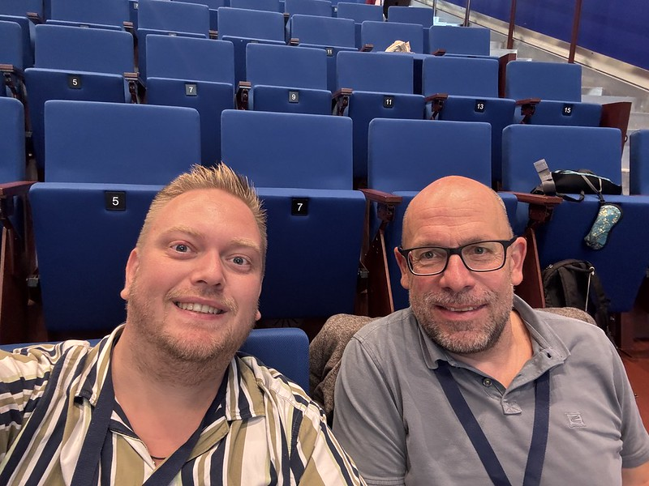
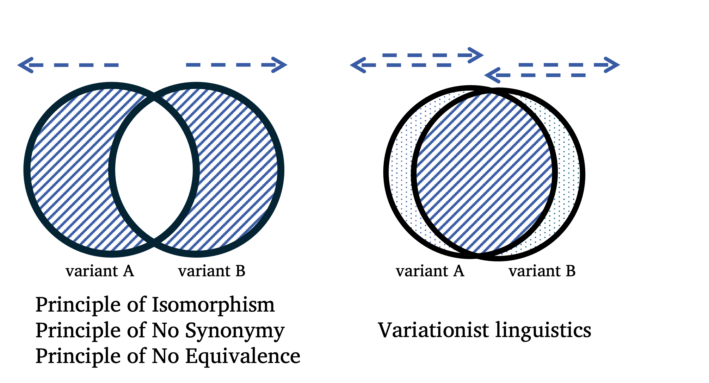
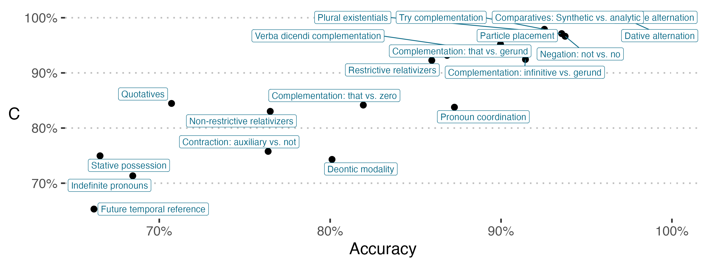

To my surprise I haven't talked much about \*the other side \* of my research life.
That is, my long-time research interest clearly has been iconicity and ideophones and what have you.
But in fact, I have also been working in what has turned out to be a great collaboration with [Benedikt Szmrecsanyi](https://sites.google.com/site/bszmrecsanyi/) on grammatical variation.
Or rather, how we have come to term it, ✨ grammatical optionality ✨.

So this post is a short reflection on our ongoing project, its past, its presence (?), and its future.
The occasion is that we have had 2 (!!) new papers appear online.
Seems like [the acceptance era is going strong](https://www.thomasvanhoey.com/posts/2025-04-29-double-whammy/).

1. Van Hoey, Thomas, Benedikt Szmrecsanyi & Matt H. Gardner. 2025 (but published in 2026 lol). Choice and complexity: In naturally occurring data, absolute complexity does not necessarily trigger relative complexity. Linguistic Typology at the Crossroads 5(2). 323–351. https://doi.org/10.60923/issn.2785-0943/19727.

2. Van Hoey, Thomas, Matt Hunt Gardner, Ruiming Ma & Benedikt Szmrecsanyi. 2026. Unpredictable grammatical choices are not harder than predictable grammatical ones. Language Variation and Change 1–23. https://doi.org/10.1017/S0954394526100660.

# Grammatical optionality, qu'est-ce que c'est ça?

To briefly illustrate the phenomenon we're interested in, we can just use two short examples.
Consider the following pairs of sentences.

(1) The witch gave the poison to the assassin.  
(2) The witch gave the assassin the poison.

Or

(3) The witch's magic wand.  
(4) The magic wand of the witch.

These expressions are tantamount in English, and are respectively called the dative alternation and the genitive alternation.
They have been a professional fascination of Benedikt's for the last fifteen years or so of his career.

Such variation is in principle present in the grammar of English (in this case).
In other words, it is available to any speaker.
But the deal is, when speaking, **you have to make a choice**.
Which of these two (or more) grammatical options makes its way out of your mouth?

Now the issue is that there is a foundational assumption in many linguistic frameworks and theories that having to deal with such grammatical options is messy, cumbersome, annoying.
In short, bad ☠️❌.
Benedikt often refers to the prescriptive writing guide [*The elements of style*](https://en.wikipedia.org/wiki/The_Elements_of_Style) by Strunk and White (first published in 1918). 
Or there is the idea that, if at some point, a linguistic system develops multiple options to kinda express the same thing (insert obligatory reference to Bill Labov RIP), it's probably a temporary thing...

The only problem with such thinking is that (a) e.g. the dative alternation has been around for a while, (b) some of these phenomena can be found in wildly different languages, (c) there is a wide array of such phenomena that has been discussed in an ever increasing pile of research literature. 

Still, there are difficulties involved in such alternations. 
For instance, when speaking, people have to mentally scan ahead to kind of figure out how long their linguistic constituents (the little groups of words that go together) will be. 
We tend to place longer constituents at the end of a dative or genitive alternation, in different grammatical optionality contexts. 
Try using the other alternative for the following two sentences. 
Feels awkward, huh?!

(5) The witch gave the poisson \[to the assassin who just came back from holiday.\]  
(6) The witch gave the assassin \[the poisson that had been prepared for a year and a day.\]

And this way, previous work has found many such "language-internal constraints". 
But also so-called language-external constraints, like dialect variation, or gender, or age (although we can't really find effects for those things in our data).

# So what's the big idea?

Given what I've tried to summarize before, you might think: gee whiz, scanning ahead, choosing an option (#keuzestress); that all sounds like a lot of work.
Maybe having grammatical optionality in your linguistic system really is a drag. 
Wouldn't it be better if one form corresponded to one meaning (disregarding all the evidence of the contrary)?
And if it's bad to have multiple ways to express kinda the same thing, wouldn't people then go *uh* and *um* the whole time, or need this time to reflect before uttering the choice they made?

THAT'S WHAT THE RESEARCH IS ABOUT.

So, Benedikt Szmrecsanyi and a former postdoc here at KU Leuven, [Matt Hunt Gardner](https://www.matthuntgardner.com/) made [this really cool paper in 2021](https://journals.plos.org/plosone/article?id=10.1371/journal.pone.0252602) about how in spoken data they do not find this purported / expected correlation between having optionality contexts in a spoken turn and so-called \* speech dysfluencies \*.

That was a great seminal paper, but there were still many questions left unanswered.
And that's where I enter the picture.

I was very happy to work in my second postdoc with Benedikt (and, remotely, Matt!) on outstanding issues that had to do with potential confounds to that absence of positive correlation. 
Of course, this is good scientific practice: maybe it was the kind of grammatical alternation that influenced the results? (No, see Van Hoey et al. 2025 in *Linguistic Typology at the Crossroads*).
Maybe it was the number of options one could choose from? (No, see Ma et al. 2025 in *English Language and Linguistics*).
Maybe the number of constraints that govern those choices? (No, see Ma et al. 2025 in *English Language and Linguistics*).
*Hmm*.
How about the cues present when making a choice? Like, *surely* choices that are more constrained are easier, because more signals point toward one option over the other?? 
No??? 
- See Van Hoey et al. 2026 in *Language Variation and Change*.

Anyway, that was a short summary of the collaborations over the past few years.
Now it's time for some short reflections.

# ✨ Reflections ✨

(I'm sorry, I just like the sparkles emoji.)

In my first postdoc in Hong Kong, I learned how to conduct lab-based experiments, and I guess I got more confidence in the idea that you can really have multiple projects going on at the same time. 
In this second postdoc, I really got to witness what it's like to build a research program.
Based on that 2021 paper, Benedikt acquired an internal KU Leuven grant (which I got hired on).

This led to a number of MA theses, and a PhD student, MA Ruiming, who I am co-supervising.
She works on the replication of our findings in Mandarin spoken data, which involves identifying, describing, and annotating such grammatical optionality contexts in Mandarin, alongside the dysfluencies. 

It also led to another PhD student (who I'm in the committee of), HUANG Fen, who takes a slightly more experimental approach. 
At the same time, we have (had) other excellent PhD students, like GUAN Sumin and LI Yi, but also TIAN Xiaoyu and LIU Meili, who have (or are) provided detailed studies of particular alternations in Mandarin, their constraints, and their so-called envelopes of variation, stamps included.
And honestly, it has been good for my Chinese knowledge to keep involved with this too.
I certainly learned a lot.

Then another thought I had related to our project is its dissemination strategy. 
I have often felt that we kind of deliver similar messages at different conferences. 
After having come across the term salami slicing, I have made the reflection whether our research is like that.
In the end, I don't think so. 
Because, as you see, I certainly have reviewed papers that were like "here's a micro detail, see recent publications (Author 1, Author 2, Author 3, Author 4, all in 2026 -- anonymized for review)". 
And that's decidedly *not* what has been going on with our project.

In fact, every "maybe" question in the previous section involved *a lot* of manual annotation labor, rethinking what the best analysis method is for the particular question, reframing our findings in light of what was already known etc. 
And that's very different from, to take a random example from the paradigm of pokémonastics  having a fixed dataset, throwing it in a n-to-n mapping statistical software, seeing what correlations have *p < 0.05* and then "motivating" how that should relate to natural language (see an upcoming book chapter), and spreading those findings over multiple papers (the hate is strong).

But yeah, in doing so, I've witnessed that a multi-year spread makes sense.
I guess it's a form of [slow science](https://www.slow-science.com/), although that is partly due to the slow movements of the peer review juggernaut.
For example, the paper in Van Hoey et al. 2025 (*Linguistic Typology at the Crossroads*) was actually the first paper I wrote together with Benedikt and Matt, back in 2024. 
Now, we kinda submitted another one first (the Ma et al. one) but that was also because this one was submitted to a special issue.
[And it's a great special issue, I recommend interested readers to have a look, also fully open access so NO EXCUSES.](https://typologyatcrossroads.unibo.it/issue/view/1453)
That said, confusingly, it was published in 2026 but belongs to the 2025 special issue.

The other paper, Van Hoey et al. 2026 (the real 2026, in *Language Variation and Change*) was a bit tougher.
We had some reviewers that approached the topic from a position that at the time seemed diametrically opposed to us.
In the meantime, we have found that our perspectives are more complementary and perhaps involve more overlap than initially thought.
Perhaps the dance party at last year's SLE conference in Bordeaux Montaigne helped to straighten out any kinks in the cable (somehow I feel like I'm mixing metaphors and languages here, hmm, let's run with #wordsmith and #yolo), demonstrating again that science involves a research community of scholars, and that communication is key.

# The future - a step and a leap forward

In fact, those reviewers organized a great workshop (Benoît and Cameron, I want to expressly state that again). 
The next step forward for our bigger grammatical optionality project is then to work on other types of dysfluencies, with the hope of featuring in the special issue edited by Benoît Leclerq and Cameron Morin.

However, there's more exciting news.
**THE NEXT LEAP FORWARD** is that Benedikt and I (in collaboration with Matt) have obtained funding from the Research Foundation Flanders (FWO) to build the next addition to our optionality house.

That means **WE ARE HIRING.**
We are extending the research program by investigating phonological and lexical optionality as well.
After all, if the dysfluencies in speech aren't triggered by grammatical optionality, perhaps there are other types of optionality that make them come out.

So yeah, [here's the job ad.](https://www.kuleuven.be/personeel/jobsite/jobs/60643123?lang=en)
Feel free to spread among your network.

# Finally, some pictures

Weird right, having a blog update without pics thus far.
I guess I can share two key figures from the paper.

From Van Hoey et al. (2025, *Linguistic Typology at the Crossroads*) there is this diagram. 
Basically, it's a way to quickly visualize how two basic and fundamental starting points can influence how one deals with the type of variation we have been investigating.
Basically, both groups recognize that alternations exist. 
But the left group, adhering to these Principles (I won't go super deep into it, that's what the papers are for) focuses on what sets two or more options apart.
The right group, variationists, instead wallow, but also revel, in the mess that is (near-)synonymy. 

> Two roads diverged in a yellow wood,

and the one you take here has significant downstream consequences for the kinds of research you do.
Nothing more, nothing less.

The second figure is this one, from Van Hoey et al. (2026, *Language Variation and Change*). 
Here, we found a way to quantify the relative difficulty of different types of alternations.
Future temporal reference (the choice between choosing *will*, *shall*, *be going to*, *gonna* etc.) is rather hard.
Conversely, the dative alternation (*give you the soup* vs. *give the soup to you*) is rather "easy".
This probably has to do with the (type of) constraints that have been identified that govern these alternations, and also the possibility space, but it deserves follow-up work.
Interestingly, I heard from a colleague in Gothenburg (Sweden) that she found something similar, but I need to know more before I say more.

And there you have it.

Two new papers, a small step forward, a big leap forward, and a #ScienceCommunication bulletin to with capital SC.

Please spread the PhD vacancy among interested parties.

